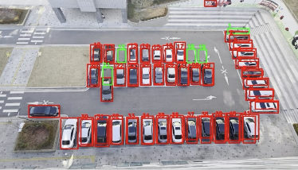
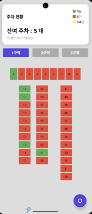
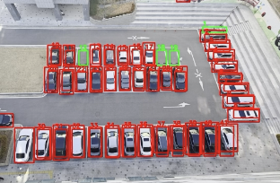
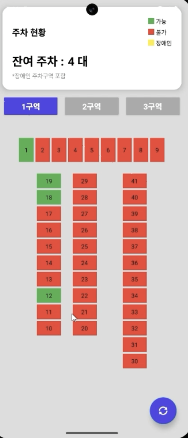

# 🚗 Parking Slot Detection Project (P-Project)

This project uses a **YOLO-based vehicle detection model** to automatically identify whether each parking slot is occupied or free.  
The system detects vehicles in images or video frames and checks whether the center point of each detected bounding box lies inside predefined parking slot regions.

The model is trained on the VisDrone dataset and provides accurate detection performance for cars, vans, trucks, and motorcycles.

---

## 📌 Features

- Real-time vehicle detection using YOLOv8  
- Parking slot coordinate mapping for partitions (1–3)  
- Automatic occupancy calculation for each slot  
- Video frame extraction for detection tasks  
- JSON/Python-based slot coordinate storage  

---

## 📥 Download Model Weights

You can download the YOLOv8 VisDrone model from HuggingFace:

👉 **YOLOv8 VisDrone Weights**  
https://huggingface.co/Mahadih534/YoloV8-VisDrone

After downloading, place the file inside the `weights/` directory.

---

## 📊 Results

Here are the visual results of the Parking Slot Detection system. The model effectively identifies vehicle types and maps them to predefined parking areas to determine occupancy.

| | |
|:---:|:---:|
|  |  |
|  |  |

