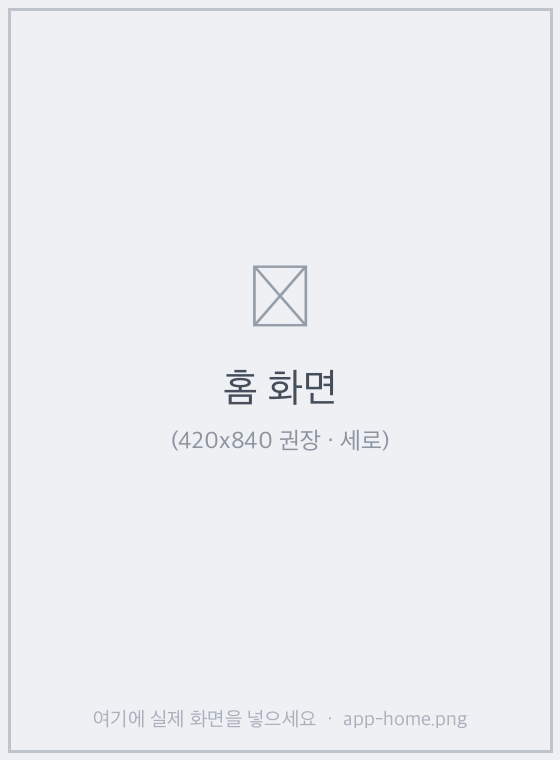

# 말해주차 (Smart Parking)

> YOLO 영상분석으로 주차 점유를 자동 감지하고, 그 현황을 **웹과 안드로이드 앱**에서 지도·검색·음성으로 확인하는 스마트 주차 시스템

영상에서 차량을 탐지해 빈자리를 실시간 계산하고, 사용자는 지도에서 주차장을 찾거나 *"AI공학관 빈자리 있어?"* 처럼 음성으로 물어볼 수 있습니다.

---

## 데모

### 📱 앱 시연 

https://github.com/user-attachments/assets/45ec23cd-3f46-4bfd-8b5b-ca47ef2af78d


### 🖥️ 웹 시연 

https://github.com/user-attachments/assets/75c39284-f4ce-4d63-8e52-62084096cfc9


### 🎤 음성 질의 _(실시간 · 소리 포함)_

https://github.com/user-attachments/assets/24441991-839a-4149-a5fb-b14758774339


---

## 주요 기능

- **점유 감지**: YOLO가 영상에서 차량을 탐지해 주차장별 빈자리/총칸 계산 (추론 주기 약 5초)
- **지도 기반 등록(웹)**: 지도에서 위치를 클릭해 장소·주차장을 동적 등록(영상 업로드)·삭제. 데이터는 영속 저장
- **장소 검색**: 장소명 검색(네이버 지역검색)으로 지도 이동
- **음성 질의**: 음성 질문 → LLM(Gemini)이 현황 기반 자연어 답변 → 음성 출력 (웹·앱)
- **앱**: 지도 핀 → 주차장별 현황(여유/혼잡/만차), 슬롯 사진 오버레이, 즐겨찾기, 내 주차위치 저장·추적, 빈자리 알림·알림함

---

## 결과 화면

### 앱

| 홈 화면 | 지도 + 핀 (주차장 현황) | 슬롯 사진 오버레이 |
|:---:|:---:|:---:|
|  |  |  |

| 음성 질의 | 내 주차 위치 | 빈자리 알림 / 알림함 |
|:---:|:---:|:---:|
|  |  |  |

> 슬롯 색: 🟩 가능 · 🟥 점유 · 🟨 장애인 구역. 구역(파티션)별로 탭해서 볼 수 있습니다.

### 웹

| 지도에서 핀 찍어 장소·주차장 등록 | 웹 주차 현황 |
|:---:|:---:|
|  |  |

---

## 아키텍처 / 폴더 구조

```
P-Project/
├─ fastapi/        YOLO 추론 서버 (영상 → 슬롯 점유)
├─ springboot/     API + 웹 UI + 인증 + 음성·검색 프록시
├─ P_Application/  안드로이드 앱 (백엔드 호출 모바일 클라이언트)
├─ docs/           설계·구현 계획 문서
└─ run.sh          백엔드 통합 실행 스크립트
```

| 폴더 | 설명 | 기술 |
|---|---|---|
| `fastapi/` | 영상에서 차량 탐지 → 슬롯 점유 계산 (`/status`) | Python, FastAPI, Ultralytics YOLO, OpenCV |
| `springboot/` | 장소/주차장 API + 웹 UI + 인증 + 음성·검색 프록시 | Java 17, Spring Boot 4, JPA, H2, Spring Security |
| `P_Application/` | 안드로이드 앱 | Android(Java), Retrofit, 네이버 지도 SDK |

> 세 컴포넌트는 코드 공유가 아니라 **HTTP REST API**로 연결됩니다.
> 앱·웹 → Spring Boot(8080) → FastAPI(8000).

---

## 사전 준비 (Prerequisites)

| 도구 | 버전 | 용도 |
|---|---|---|
| Java (JDK) | 17 | Spring Boot |
| Python | 3.10+ | FastAPI / YOLO |
| Android Studio | 최신 | 앱 빌드(선택) |
| API 키 | — | 네이버 지도/검색, Gemini (아래 환경변수) |

```bash
# macOS 예시
brew install openjdk@17
python3 --version   # 3.10 이상인지 확인
```

---

## 설치 & 실행

### 1) 저장소 받기

```bash
git clone https://github.com/leehnsong/P-Project.git
cd P-Project
```

### 2) FastAPI 의존성 설치 (가상환경)

> ⚠️ `run.sh`는 venv가 **`fastapi/video_test/venv`** 에 있다고 가정합니다. 아래 경로 그대로 만드세요.

```bash
cd fastapi/video_test
python3 -m venv venv
source venv/bin/activate          # Windows: venv\Scripts\activate
pip install -r requirements.txt
cd ../..
```

### 3) 데이터·모델 준비 (필수 — git에 포함되지 않음)

용량/저작권 문제로 아래 파일은 저장소에 없습니다. **별도로 받아서** 해당 위치에 두어야 정상 동작합니다.

| 두는 곳 | 내용 |
|---|---|
| `fastapi/video_test/weights/visDrone.pt` | YOLO 가중치. 없으면 FastAPI 시작 시 모델 로드에서 **에러** |
| `fastapi/video_test/videos/*.mp4` | 분석할 주차장 영상. 파일명이 `map/<key>_slots.json` 과 짝이 맞아야 함 |

> **DB는 비어 있는 상태로 시작합니다.** 등록된 장소/주차장 데이터(H2, `springboot/data/`)는 공유되지 않으므로, 실행 후 **웹 지도에서 직접 장소·주차장을 등록**(영상 업로드)하면 됩니다.

### 4) 환경변수(API 키) 설정

`.env.example`를 참고해 키를 환경변수로 등록합니다 (아래 [환경변수](#환경변수-api-키) 표 참고).
`run.sh`는 셸 프로필(`~/.zshrc` 등)에 등록된 키를 자동으로 읽어옵니다.

### 5) 백엔드 실행 (Spring Boot + FastAPI 한 번에)

```bash
./run.sh
```

- Spring Boot 웹: <http://localhost:8080/>
- FastAPI(YOLO): <http://localhost:8000/>

<details>
<summary>개별 실행 / 영상 분석 창 보기</summary>

```bash
# Spring Boot
cd springboot && ./gradlew bootRun

# FastAPI (별도 터미널). SHOW_GUI=1 이면 분석 창까지 표시
cd fastapi/video_test
SHOW_GUI=1 ./venv/bin/python server0.py
```
</details>

### 6) 안드로이드 앱 (선택)

Android Studio에서 `P_Application/`을 열고 에뮬레이터/실기기로 실행합니다.

- **네이버 지도 키 설정**: `P_Application/local.properties`(git 미추적)에 아래 한 줄을 추가하세요.
  ```properties
  NAVER_MAP_CLIENT_ID=발급받은_NCP_KEY_ID
  ```
  (또는 환경변수 `SMARTPARKING_NAVER_MAP_CLIENT_ID` 로도 인식됩니다. Android Studio를 아이콘으로 실행하면 환경변수를 못 읽으므로 `local.properties` 권장.)
- 앱은 에뮬레이터 기준 `http://10.0.2.2:8080`(= PC의 localhost)으로 백엔드를 호출합니다.
- 따라서 앱 실행 전 **백엔드(`./run.sh`)가 켜져 있어야** 합니다.

---

## 환경변수 (API 키)

키는 소스에 포함하지 않고 환경변수로 관리합니다. `.env.example` 참고.

| 변수 | 용도 |
|---|---|
| `SMARTPARKING_NAVER_MAP_CLIENT_ID` | 네이버 지도 표시 |
| `SMARTPARKING_NAVER_SEARCH_CLIENT_ID` / `_SECRET` | 장소명 검색(지역검색 API) |
| `SMARTPARKING_GEMINI_API_KEY` | 음성 질의 답변 생성(Gemini) |
| `SMARTPARKING_JWT_SECRET` | 로그인 JWT 서명 |

---

## 주요 API (요약)

- 조회: `GET /api/campus/map`, `GET /api/campus/buildings/{id}`
- 등록/삭제: `POST /api/buildings`, `POST /api/buildings/{id}/parking-lots`, `DELETE ...`
- 검색: `GET /api/geo/search?query=`
- 음성: `POST /api/voice/ask`
- 인증: `POST /auth/login`, `POST /auth/register`
- 내 정보(로그인 필요): `/api/me/parking-location`, `/api/me/alert-rules`, `/api/me/notifications`

자세한 설계는 [`docs/`](docs/) 참고.
